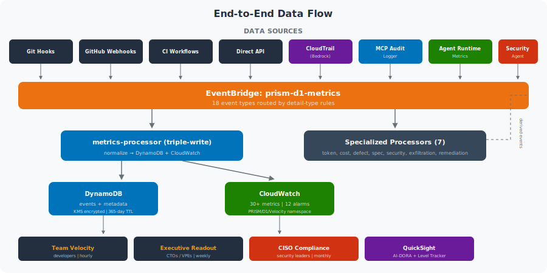

# PRISM D1 Velocity — Data Architecture & Metrics Pipeline

> **Last updated:** 2026-04-27
> **Purpose:** Document how every AI-assisted action becomes a measurable metric — from git commit to executive dashboard.

---

## Overview

**9 data sources** feed into **EventBridge**, processed by **Lambda** (1 core processor + 8 specialized), triple-written to **DynamoDB** (events + metadata, KMS-encrypted) and **CloudWatch** (time-series). **18 event types** carry DORA, AI-DORA, cost, security, and quality metrics across the full AI development lifecycle.

---

## End-to-End Data Flow



---

## Data Sources

### 1. Git Hooks (Local Machine)

Installed via `bootstrapper/metric-hooks/install.sh`. Fire automatically on every commit and merge.

| Hook | Trigger | Data Captured | Output |
|------|---------|---------------|--------|
| **prepare-commit-msg** | Before commit message editor | Detects AI tool via env vars, scans for Co-Authored-By, detects spec files in staged changes | Adds trailers: `AI-Origin`, `AI-Tool`, `AI-Model`, `Spec-Ref` |
| **post-commit** | After successful commit | SHA, author, files changed, lines added/removed, all trailers from message | JSON to `.prism/metrics/` + async emit to EventBridge |
| **post-merge** | After merge or git pull | AI commits vs human commits on branch, lead time (first commit → merge), AI-to-merge ratio | JSON to `.prism/metrics/` + async emit to EventBridge |

**AI Tool Detection Logic:**

| Tool | Detection Method | Trailers Added |
|------|-----------------|----------------|
| **Claude Code** | `CLAUDE_CODE` or `CLAUDE_SESSION_ID` env var | `AI-Tool: claude-code`, `AI-Origin: ai-assisted` |
| **Kiro** | `KIRO_SESSION` env var, or spec files in staged changes | `AI-Tool: kiro`, `Spec-Ref: path/to/spec` |
| **Q Developer** | `Q_DEVELOPER_SESSION` env var | `AI-Tool: q-developer` |
| **Other AI** | Scans commit message for "Co-Authored-By", "generated by" | `AI-Origin: ai-generated` |
| **Human** | No AI signals detected | `AI-Origin: human` |

### 2. GitHub Webhooks

The webhook handler at `collector/github-webhook-handler/index.ts` processes 5 event types with HMAC-SHA256 signature verification.

| GitHub Event | Event Type Emitted | Key Data Extracted |
|-------------|-------------------|-------------------|
| **push** | `prism.d1.commit` | Files changed per commit, AI trailers parsed from each commit message, aggregate AI ratio |
| **pull_request** (merged) | `prism.d1.pr` | Lead time (created_at → merged_at), lines changed, AI-to-merge ratio |
| **deployment** | `prism.d1.deploy` | Deployment frequency count (1 per event) |
| **deployment_status** | `prism.d1.deploy` | Change failure rate: 1 if failure/error, 0 if success |
| **check_run** (eval-*) | `prism.d1.eval` | Eval gate pass/fail, duration |

### 3. GitHub Actions Workflows

| Workflow | Trigger | Calculates | Emits |
|----------|---------|-----------|-------|
| **prism-ai-metrics.yml** | PR merged to main | AI-to-merge ratio, lead time, acceptance rate (approved / total reviews) | `prism.d1.pr` + `prism.d1.deploy` |
| **prism-dora-weekly.yml** | Monday 09:00 UTC | 7-day DORA snapshot, AI adoption rate, spec coverage, tool breakdown | `prism.d1.assessment` |
| **prism-agent-eval.yml** | PR touching agent paths | Agent quality scores via Bedrock rubric | `prism.d1.agent.eval` |

### 4. Direct API Ingestion

- **Endpoint:** `POST /metrics`
- **Auth:** API key + usage plan
- **Rate:** 50 req/s burst, 100K/month quota
- **Use case:** Custom integrations, third-party CI, manual metric submission

### 5. CI Metadata Emitter

Shell script at `collector/ci-metadata-emitter/emit-metrics.sh` that runs inside GitHub Actions. Parses git log from base ref to HEAD, counts commits by AI origin, calculates AI-to-merge ratio, emits to EventBridge.

---

### 6. Bedrock CloudTrail Events

CloudTrail captures every Bedrock API call (InvokeModel, Converse, etc.) with token counts. An EventBridge rule on the **default** event bus routes these to the `token-processor` Lambda, which enriches with pricing and identity data.

### 7. MCP Tool Call Audit

The MCP server's audit logger emits `prism.d1.mcp.tool_call` events to EventBridge for every tool call that requires audit (medium/high risk tools).

### 8. Agent Runtime Metrics

Agent invocations emit `prism.d1.agent` events with step counts, tool calls, tokens used, and guardrail triggers. Individual guardrail triggers emit separate `prism.d1.guardrail` events with category, type, and action details.

### 9. AWS Security Agent

AWS Security Agent performs proactive security scanning across three AI-DLC phases:

| Phase | Trigger | What It Scans | Event Type |
|---|---|---|---|
| Design Review | Spec/design doc committed | Architecture decisions, data flows, auth design | `prism.d1.security.design_review` |
| Code Review | PR opened/updated | Source code against org security policies | `prism.d1.security.code_review` |
| Pen Testing | Deploy to staging | Running application (OWASP Top 10, business logic) | `prism.d1.security.pen_test` |

Findings are ingested via `POST /security-findings` webhook or scheduled polling, enriched with team_id and AI origin, and emitted to EventBridge. The `security-remediation-tracker` Lambda correlates findings with merged PRs to calculate remediation time. The `security-response-automator` Lambda triggers alarms and eval gate penalties on Critical/High findings.

CDK resources provisioned: `CfnAgentSpace` (scope + KMS encryption), `CfnTargetDomain` (pen test scope registration), IAM service role, CloudWatch Log group. See `infra/lib/constructs/security-agent-construct.ts`.

---

## Event Schema

Every event follows this base structure on EventBridge:

```json
{
  "source": "prism.d1.velocity",
  "detail-type": "prism.d1.commit | .pr | .deploy | .eval | .incident | .assessment | .agent | .agent.eval | .guardrail | .mcp.tool_call | .token | .cost | .security | .quality",
  "detail": {
    "team_id": "team-alpha",
    "repo": "owner/repo-name",
    "timestamp": "2026-04-22T14:30:00Z",
    "prism_level": 3,
    "metric": {
      "name": "commit.files_changed",
      "value": 5,
      "unit": "files"
    },
    "ai_context": {
      "tool": "claude-code",
      "model": "claude-sonnet-4",
      "session_id": "sess_abc123",
      "origin": "ai-assisted"
    },
    "dora": {
      "deployment_frequency": 1,
      "lead_time_seconds": 3600,
      "change_failure_rate": 0.0,
      "mttr_seconds": null
    },
    "ai_dora": {
      "ai_acceptance_rate": 0.85,
      "ai_to_merge_ratio": 0.70,
      "spec_to_code_hours": 1.8,
      "post_merge_defect_rate": 0.014,
      "eval_gate_pass_rate": 1.0,
      "ai_test_coverage_delta": 0.123
    }
  }
}
```

---

### Extended Event Payloads

Events may include additional top-level fields depending on their type:

| Field | Event Types | Description |
|-------|------------|-------------|
| `eval` | `prism.d1.eval` | Eval ID, rubric name, result, score, criterion scores |
| `guardrail` | `prism.d1.guardrail` | Guardrail ID, trigger category/type, action taken, agent name |
| `mcp_tool_call` | `prism.d1.mcp.tool_call` | Session ID, client ID, tool name, scopes, authorized flag, risk level |
| `token` | `prism.d1.token` | Model ID, input/output tokens, cost USD, IAM principal, developer email |
| `cost` | `prism.d1.cost` | Commit SHA, total tokens, total cost, models used, correlation window |
| `quality` | `prism.d1.quality` | AI defect rate, human defect rate, AI/human commit counts |
| `security` | `prism.d1.security` | Alert type, table name, principal ARN, read count |
| `security_agent_finding` | `prism.d1.security.{design_review,code_review,pen_test}` | Finding ID, phase, severity, CVSS, category, CWE, exploit validated, compliance mappings, AI origin, spec ref |
| `security_remediation` | `prism.d1.security.remediation` | Finding ID, severity, remediation time hours, remediated by origin, fix PR number |

---

## Specialized Lambda Processors

In addition to the core metrics-processor, eight specialized Lambdas handle derived metric calculations:

| Lambda | Trigger | Input | Output |
|--------|---------|-------|--------|
| `prism-d1-token-processor` | CloudTrail Bedrock API calls (default bus) | CloudTrail event with token counts | `prism.d1.token` event with pricing + identity |
| `prism-d1-token-correlator` | `prism.d1.commit` events | Commit timestamp | `prism.d1.cost` event with cost-per-commit |
| `prism-d1-defect-correlator` | `prism.d1.deploy` events | Failed deployment | `prism.d1.quality` event with AI vs human defect rates |
| `prism-d1-spec-to-code-calculator` | `prism.d1.pr` events | Merged PR with Spec-Ref | `prism.d1.pr` event with spec_to_code_hours |
| `prism-d1-exfiltration-detector` | CloudTrail DynamoDB read events (default bus) | DynamoDB Query/Scan/GetItem | `prism.d1.security` event when threshold exceeded |
| `prism-d1-security-agent-processor` | `POST /security-findings` webhook or scheduled poll | Security Agent findings | `prism.d1.security.*` events enriched with team_id + AI origin |
| `prism-d1-security-remediation-tracker` | `prism.d1.pr` events (merged PRs) | PR merge + open findings | `prism.d1.security.remediation` event with fix timing |
| `prism-d1-security-response-automator` | `prism.d1.security.code_review` / `.pen_test` | Critical/High findings | Eval gate penalty + alarm escalation |

---

## Processing & Storage

The Lambda processor (`infra/lib/lambda/metrics-processor.ts`) does a **triple-write** for every event:

### Write 1: DynamoDB Events Table

| Field | Value | Purpose |
|-------|-------|---------|
| **Table** | `prism-d1-events` | Immutable event log |
| **Partition Key** | `{team_id}#{repo}` | Team+repo scoping |
| **Sort Key** | `{timestamp}` ISO 8601 | Time-ordered within partition |
| **GSI** | `by-detail-type` (PK: detail_type, SK: timestamp) | Query by event type across teams |
| **TTL** | 365 days | Auto-expire old events |

### Write 2: DynamoDB Metadata Table

| Field | Value | Purpose |
|-------|-------|---------|
| **Table** | `prism-team-metadata` | Latest snapshot per team/repo |
| **Key** | `team_id` + `repo` | Fast lookup for current state |
| **Updated** | Every event overwrites latest values | Always-current DORA + AI-DORA numbers |

### Write 3: CloudWatch Metrics

Published to namespace `PRISM/D1/Velocity` with dimensions:

| Dimension | Source | Required |
|-----------|--------|----------|
| **TeamId** | `detail.team_id` | Yes |
| **Repository** | `detail.repo` | Yes |
| **AIOrigin** | `detail.ai_context.origin` | Optional — enables filtering by ai-generated / ai-assisted / human |
| **AgentName** | `detail.agent.name` | Optional — for agent metrics only |
| **RubricName** | `detail.eval.rubric` | Optional — for per-rubric eval metrics |
| **TriggerCategory** | `detail.guardrail.trigger_category` | Optional — for guardrail metrics |
| **ToolName** | `detail.mcp_tool_call.tool_name` | Optional — for MCP tool metrics |
| **Model** | `detail.token.model_id` | Optional — for token/cost metrics |
| **Developer** | `detail.token.developer_email` | Optional — for per-developer cost attribution |

> All metrics are also published **without dimensions** for aggregate queries across all teams and repos.

---

## CloudWatch Metrics Catalog

### DORA Metrics

| Metric Name | Unit | Source |
|------------|------|--------|
| `DeploymentFrequency` | Count | Deploy events, weekly workflow |
| `LeadTimeForChanges` | Seconds | PR merge time, post-merge hook |
| `ChangeFailureRate` | Percent | Deployment status, weekly workflow |
| `MTTR` | Seconds | Issue open-to-resolution time |

### AI-DORA Metrics

| Metric Name | Unit | Source |
|------------|------|--------|
| `AIAcceptanceRate` | Percent | PR review approval rate for AI-assisted PRs |
| `AIToMergeRatio` | Percent | AI commits / total commits per merge |
| `EvalGatePassRate` | Percent | Bedrock eval check_run results |
| `SpecToCodeHours` | Hours | Spec commit to code PR timestamp |
| `PostMergeDefectRate` | Percent | Bug tracker + AI origin tag correlation |
| `AITestCoverageDelta` | Percent | Coverage tool + AI origin tag |

### Agent Metrics

| Metric Name | Unit | Source |
|------------|------|--------|
| `AgentInvocationCount` | Count | Agent runtime events |
| `AgentStepCount` | Count | Steps per invocation |
| `AgentDurationMs` | Milliseconds | Execution time |
| `AgentTokensUsed` | Count | LLM token consumption |
| `AgentToolInvocationCount` | Count | MCP tool calls |
| `AgentGuardrailTriggerCount` | Count | Bedrock Guardrail triggers |
| `AgentSuccessRate` | Percent | 100 if success, 0 if failed |

### Eval Gate Metrics

| Metric Name | Unit | Source |
|------------|------|--------|
| `EvalGatePassRateByRubric` | Percent | Eval gate workflow, per rubric type |
| `EvalScore` | None (0-1) | Eval gate workflow, average score |

### Guardrail Metrics

| Metric Name | Unit | Source |
|------------|------|--------|
| `GuardrailTriggerCount` | Count | Agent guardrail trigger events, per category |
| `GuardrailBlockCount` | Count | Content blocked by guardrails |
| `GuardrailAnonymizeCount` | Count | PII anonymized by guardrails |

### MCP Tool Metrics

| Metric Name | Unit | Source |
|------------|------|--------|
| `MCPToolCallCount` | Count | MCP server audit logger |
| `MCPAuthDeniedCount` | Count | Unauthorized tool call attempts |
| `MCPToolCallDurationMs` | Milliseconds | Tool execution time |

### Cost & Token Metrics

| Metric Name | Unit | Source |
|------------|------|--------|
| `BedrockTokensInput` | Count | CloudTrail → token-processor Lambda |
| `BedrockTokensOutput` | Count | CloudTrail → token-processor Lambda |
| `BedrockCostUSD` | None (USD) | Token-processor × pricing table |
| `CostPerCommit` | None (USD) | Token-commit-correlator Lambda |
| `TokenEfficiency` | None | Tokens per line of code changed |

### Quality & Attribution Metrics

| Metric Name | Unit | Source |
|------------|------|--------|
| `PostMergeDefectRateAI` | Percent | Defect-correlator Lambda |
| `PostMergeDefectRateHuman` | Percent | Defect-correlator Lambda |

### Security Metrics

| Metric Name | Unit | Source |
|------------|------|--------|
| `ExfiltrationAlertCount` | Count | Exfiltration-detector Lambda |
| `SecurityFindingCount` | Count | Security-agent-processor Lambda (dims: Phase, Severity) |
| `SecurityCriticalFindingCount` | Count | Security-agent-processor Lambda (Critical + High only) |
| `SecurityFindingByOrigin` | Count | Security-agent-processor Lambda (dims: AIOrigin) |
| `SecurityFindingCVSS` | None (0-10) | Security-agent-processor Lambda (CVSS score per finding) |
| `PenTestExploitCount` | Count | Security-agent-processor Lambda (validated exploits) |
| `SecurityScanCount` | Count | Security-agent-processor Lambda (dims: Phase) |
| `SecurityRemediationTimeHours` | Count (hours) | Security-remediation-tracker Lambda (dims: Severity, AIOrigin) |

---

## Active Alarms

| Alarm | Metric | Threshold | Period |
|-------|--------|-----------|--------|
| AI Acceptance Rate Low | AIAcceptanceRate | < 20% | 6 hours |
| Eval Gate Pass Rate Low | EvalGatePassRate | < 70% | 6 hours |
| Change Failure Rate High | ChangeFailureRate | > 20% | 6 hours |
| Agent Success Rate Low | AgentSuccessRate | < 80% | 1 hour |
| Guardrail Block Rate High | GuardrailBlockCount | > 50 | 1 hour |
| Bedrock Daily Cost High | BedrockCostUSD | > $100 | 1 day |
| Token Efficiency Low | TokenEfficiency | > 500 | 6 hours |
| Exfiltration Alert | ExfiltrationAlertCount | ≥ 1 | 1 hour |
| Security Critical Finding | SecurityCriticalFindingCount | ≥ 1 | 1 hour |
| Pen Test Exploit Detected | PenTestExploitCount | ≥ 1 | 1 hour |
| Security Remediation SLA | SecurityRemediationTimeHours | avg > 72h | 1 day |
| Security Finding Rate High | SecurityFindingCount | > 50 | 6 hours |

---

## Dashboard Guide

PRISM ships **5 dashboards** across two AWS services, each targeting a specific audience and decision level.

### CloudWatch: Team Velocity (`PRISM-D1-Team-Velocity`)

**Audience:** Engineering teams, tech leads, ICs
**Update frequency:** Real-time (1-hour metric periods)
**Purpose:** Day-to-day operational view of how AI tools are impacting team velocity, code quality, and safety.

#### DORA & AI-DORA Metrics

| Widget | Type | What It Shows |
|--------|------|---------------|
| AI Acceptance Rate | Time series | % of AI-generated suggestions accepted by developers. Dropping trend signals review friction or quality issues. |
| Deployment Frequency | Bar chart | Deploys per day. Core DORA velocity signal — higher is better at L3+. |
| Lead Time for Changes | Time series | Seconds from PR creation to deploy. Measures how fast code moves through the pipeline. |
| Eval Gate Pass Rate | Gauge (0-100%) | % of AI-generated files passing Bedrock evaluation. Below 70% triggers an alarm. |
| AI Test Coverage Delta | Time series | Isolated AI contribution to test coverage changes — separates AI testing value from human effort. |
| Change Failure Rate | Time series | % of deployments causing a rollback or hotfix. Above 20% triggers an alarm. |
| Mean Time to Recovery | Time series | Seconds from incident to resolution. Measures operational resilience. |
| AI to Merge Ratio | Time series | % of merged code originating from AI tools. Tracks how much of the codebase AI is writing. |

#### Agent Operations

| Widget | Type | What It Shows |
|--------|------|---------------|
| Agent Invocations | Time series | Total agent executions per hour. Volume signal for agentic workloads. |
| Agent Success Rate | Time series | % of agent invocations completing successfully. Below 80% triggers alarm. |
| Agent Avg Duration | Time series | Mean execution time per agent invocation in milliseconds. |

#### Eval Gate Quality by Rubric

| Widget | Type | What It Shows |
|--------|------|---------------|
| Eval Pass Rate by Rubric | Multi-line chart | Pass rate broken down by rubric (code-quality, api-response, agent, security, spec-compliance). Shows which rubric is failing most. |
| Eval Score Trend | Time series | Average evaluation score (0-1) over time. Declining trend = AI output quality degrading. |

#### Guardrails & Safety

| Widget | Type | What It Shows |
|--------|------|---------------|
| Guardrail Triggers by Category | Stacked bar | Triggers broken down: CONTENT_FILTER, DENIED_TOPIC, SENSITIVE_INFO, WORD_FILTER. Spikes indicate prompt attack attempts or policy violations. |
| Guardrail Actions: Block vs Anonymize | Dual-line chart | Ratio of hard blocks (content rejected) vs soft anonymization (PII scrubbed). High block rate = potential misconfiguration or attack. |

#### MCP Tool Governance

| Widget | Type | What It Shows |
|--------|------|---------------|
| MCP Tool Call Volume | Time series | Total MCP tool invocations per hour. Tracks agent-to-tool activity. |
| MCP Auth Denied Rate | Time series | Unauthorized tool call attempts. Non-zero = agents attempting out-of-scope actions. |

#### Cost Intelligence

| Widget | Type | What It Shows |
|--------|------|---------------|
| Daily Token Usage (Input vs Output) | Stacked area | Input vs output token consumption per day. Output-heavy = generative workloads; input-heavy = RAG/context workloads. |
| Cost per Commit Trend | Time series | Average Bedrock cost per AI-assisted commit. Rising trend = inefficient prompting or context bloat. |
| Bedrock Cost (USD) | Time series | Total daily Bedrock spend. Tracks budget consumption. Above $100/day triggers alarm. |
| Token Efficiency | Time series | Tokens consumed per line of code changed. Lower = more efficient AI usage. Above 500 triggers alarm. |

#### AI Attribution & Quality

| Widget | Type | What It Shows |
|--------|------|---------------|
| Defect Rate: AI vs Human Code | Dual-line chart | Side-by-side post-merge defect rates. Answers "is AI code as reliable as human code?" |
| Spec-to-Code Hours | Time series | Hours from spec approval to code PR merge. Measures AI impact on the full feature lifecycle. |

---

### CloudWatch: Executive Readout (`PRISM-D1-Executive-Readout`)

**Audience:** CTOs, VPEs, engineering directors, board members
**Update frequency:** Near real-time (7-day/30-day metric periods)
**Purpose:** Leadership view connecting AI adoption to business outcomes, security posture, and cost management.

#### Strategic Overview

| Widget | Type | What It Shows |
|--------|------|---------------|
| PRISM Level Progress | Single value | Current maturity level (L1-L5). The north-star metric for AI adoption maturity. |
| Enhanced DORA Summary | Multi-value | 7-day snapshot of all 4 DORA metrics in one row. At-a-glance health check. |
| Cost per AI-Assisted Feature | Single value | Average spec-to-code hours. Proxy for "how much does a feature cost in AI-accelerated development?" |

#### Trends

| Widget | Type | What It Shows |
|--------|------|---------------|
| AI Contribution Trend | Multi-line (3 metrics) | 30-day trend of acceptance rate, merge ratio, and test coverage delta. Shows whether AI adoption is growing or plateauing. |
| Feature Cycle Time Trend | Dual-line | Spec-to-code hours and lead time together. Both should trend down as AI adoption matures. |

#### Quality Gates

| Widget | Type | What It Shows |
|--------|------|---------------|
| Eval Gate Pass Rate | Gauge (0-100%) | 7-day average pass rate. If below 70%, AI output quality needs attention. |
| Post-Merge Defect Rate | Time series | Overall defect rate trend. Should decrease as eval gates catch issues pre-merge. |
| Deployment Frequency (Weekly) | Bar chart | Weekly deploy cadence. Visual proof of velocity improvement. |

#### Security & Compliance

| Widget | Type | What It Shows |
|--------|------|---------------|
| Guardrail Blocks (7d) | Single value | Total content blocks in the past week. High = either effective guardrails or concerning prompt patterns. |
| Guardrail Trigger Trend | Time series | Daily trigger count. Sustained increase warrants investigation. |
| MCP Auth Denied (7d) | Single value | Unauthorized tool access attempts. Non-zero = agents probing beyond their scope. |
| Exfiltration Alerts (7d) | Single value | Data exfiltration pattern detections. Any non-zero value triggers the alarm. |

#### Cost Intelligence

| Widget | Type | What It Shows |
|--------|------|---------------|
| Weekly Bedrock Cost | Bar chart | Week-over-week Bedrock spend. Budget planning signal for CFOs. |
| Cost per Deploy | Single value | Average cost per AI-assisted commit. Efficiency benchmark. |
| AI vs Human Defect Rate | Dual single value | Side-by-side 7-day defect rate comparison. The "is AI code reliable?" answer for the board. |

---

### QuickSight: AI-DORA Analysis

**Audience:** Engineering managers, platform teams, data analysts
**Update frequency:** Near real-time (DynamoDB → QuickSight dataset)
**Purpose:** Deep-dive exploratory analysis across teams, repos, AI tools, and time periods.

| Sheet | Visuals | What It Shows |
|-------|---------|---------------|
| **DORA Overview** | 4 KPI widgets + trend chart | KPI cards for each DORA metric with week-over-week change arrows. Daily trend overlay shows correlation between deploy frequency and failure rate. |
| **AI Contribution** | Acceptance rate by team (bar), merge ratio trend (line), tool breakdown (pie) | Compare AI adoption across teams. See which AI tools (Claude Code, Kiro, Q Developer) produce the most merged code. |
| **Quality & Evals** | Eval pass rate KPI, defect rate comparison (AI vs human), test coverage delta trend | Track whether AI eval gates are catching issues and whether AI code quality is improving relative to human code. |
| **Spec Efficiency** | Spec-to-code by team (bar), turnaround trend by team (line) | Identify which teams are fastest at turning specs into code and whether AI is accelerating the spec-to-code pipeline. |

**Filters:** Date range (90d), Team, Repository, AI Tool, PRISM Level

---

### QuickSight: PRISM Level Tracker

**Audience:** SAs, engineering leaders, program managers
**Update frequency:** Near real-time
**Purpose:** Track maturity progression across teams and compare against benchmarks.

| Sheet | Visuals | What It Shows |
|-------|---------|---------------|
| **Level Overview** | Current level gauge, level-by-team table, level history line chart | Where each team stands on L1-L5 and how they've progressed over time. |
| **Domain Breakdown** | Radar chart (6 sub-dimensions), normalized scores table | Granular view of which dimensions (acceptance rate, cycle time, eval coverage, deploy freq, defect delta, spec speed) are strong vs weak per team. |
| **Benchmarks** | Team vs cohort comparison bar, benchmarks by funding stage table | Compare team metrics against community averages segmented by company stage (Series A-D). |

**Filters:** Date range (180d), Team selection

---

### CloudWatch: CISO Compliance (`PRISM-D1-CISO-Compliance`)

**Audience:** CISOs, security leaders, compliance officers
**Update frequency:** Near real-time (30-day metric periods)
**Purpose:** Security posture across all teams, AI code risk assessment, remediation SLA tracking.

| Section | Widgets | What It Shows |
|---------|---------|---------------|
| **Security Posture** | Open critical findings, validated exploits, avg remediation time, scan volume | Overall security health at a glance |
| **AI Code Risk Profile** | Security findings by code origin (AI vs human), remediation time by origin | Whether AI-generated code introduces more or fewer security issues |
| **Shift-Left Effectiveness** | Findings by phase (design/code/pen test), guardrail + exfiltration trends | Whether teams are catching issues earlier in the lifecycle over time |

---

## Token Usage & Cost Tracking

Token consumption and cost tracking is implemented via the CloudTrail → EventBridge pipeline.

### Prerequisites

| Requirement | How to Enable | Impact If Missing |
|---|---|---|
| **CloudTrail data events for Bedrock** | `aws cloudtrail put-event-selectors` with `AWS::Bedrock::Model` data events | No token tracking, no cost metrics, no cost dashboards, no budget alarms |
| **Identity mapping table populated** | `aws dynamodb put-item` per developer (IAM ARN → email → team) | Cost attributed to "unknown" developer |
| **Model pricing table seeded** | Auto-seeded on CDK deploy via Custom Resource | Cost calculations return $0 |

See [Bootstrapper README Step 6](../bootstrapper/README.md#step-6-enable-cloudtrail-for-bedrock-required-for-cost-tracking) for the exact setup commands.

### What's tracked

| Dimension | Status | Detail |
|-----------|--------|--------|
| Tool identity | **Tracked** | Via env var detection |
| Model used | **Tracked** | Via AI-Model trailer |
| Code output | **Tracked** | Lines/files per commit |
| Token consumption | **Tracked** | Via CloudTrail → `token-processor` Lambda |
| Cost per session | **Partial** | Cost calculated per API call, session grouping planned |
| Cost per commit | **Tracked** | Via `token-commit-correlator` Lambda (5-min window) |
| Developer-level cost | **Tracked** | Via IAM principal → identity mapping table |

### Architecture

```
Bedrock InvokeModel/Converse API calls
         |
         v
CloudTrail (logs every call with input_tokens, output_tokens, model_id)
         |
         v
EventBridge Rule (prism-d1-bedrock-api-calls)
         |
         v
Lambda: prism-d1-token-processor
  - Extract: model_id, input_tokens, output_tokens, timestamp, IAM principal
  - Look up cost: prism-model-pricing table (DynamoDB, seeded on deploy)
  - Look up identity: prism-identity-mapping table (IAM ARN → email → team)
  - Emit: prism.d1.token event
         |
         v
prism.d1.commit event triggers:
Lambda: prism-d1-token-correlator
  - Query: prism.d1.token events within 5-min window before commit
  - Aggregate: total tokens, cost, models used
  - Emit: prism.d1.cost event
         |
         v
CloudWatch: PRISM/D1/Velocity namespace
  - BedrockTokensInput / BedrockTokensOutput (by TeamId, Developer, Model)
  - BedrockCostUSD (by TeamId, Developer, Model)
  - CostPerCommit (by TeamId, Repository)
  - TokenEfficiency (by TeamId)
         |
         v
Dashboards: Daily token trends, cost by model, cost-per-commit, budget burn rate
Alarms: BedrockDailyCostHigh (>$100/day), TokenEfficiencyLow (>500 tokens/line)
```

### Remaining Gaps

| Dimension | Status | Detail |
|-----------|--------|--------|
| Session duration | **Not tracked** | Session grouping (gap > 15 min) planned as R-216 |
| Cost per PR/feature | **Not tracked** | Aggregate across PR commits planned as R-214/R-215 |
| Multi-tool cost normalization | **Not tracked** | Copilot/Cursor subscription normalization planned as R-220 |

---

## Key Files Reference

### Core Pipeline

| Component | Location | Purpose |
|-----------|----------|---------|
| Git hooks | `bootstrapper/metric-hooks/` | Local commit metadata capture + AI tool detection |
| GitHub webhook handler | `collector/github-webhook-handler/index.ts` | Process push, PR, PR review, deploy, check_run events |
| CI metric emitter | `collector/ci-metadata-emitter/emit-metrics.sh` | Shell script for GitHub Actions metric emission |
| Commit analyzer | `collector/git-hooks/prism-commit-analyzer.ts` | Standalone commit analysis tool |
| Metrics processor Lambda | `infra/lib/lambda/metrics-processor.ts` | EventBridge → DynamoDB + CloudWatch triple-write (all 14 event types) |
| API handler Lambda | `infra/lib/lambda/api-handler.ts` | REST API for ingestion + queries |
| Metrics pipeline stack | `infra/lib/metrics-pipeline-stack.ts` | EventBridge bus + DynamoDB tables + Lambda + constructs |
| API stack | `infra/lib/api-stack.ts` | API Gateway + Lambda + usage plans |
| Dashboard stack | `infra/lib/dashboard-stack.ts` | CloudWatch dashboards (3) + alarms (12) |

### Eval Gates

| Component | Location | Purpose |
|-----------|----------|---------|
| Eval gate workflow | `bootstrapper/github-workflows/prism-eval-gate.yml` | Smart rubric routing, spec compliance, PR comment |
| Eval runner | `bootstrapper/eval-harness/run-eval.sh` | CLI eval with `--spec` flag |
| Rubrics (5) | `bootstrapper/eval-harness/rubrics/*.json` | code-quality, api-response, agent, security, spec-compliance |

### MCP Authorization

| Component | Location | Purpose |
|-----------|----------|---------|
| Tool registry | `sample-app/src/mcp/auth/tool-registry.ts` | Scope definitions per tool |
| Authorizer | `sample-app/src/mcp/auth/authorizer.ts` | Session-based scope enforcement |
| Session store | `sample-app/src/mcp/auth/session-store.ts` | In-memory session management with TTL |
| Audit logger | `sample-app/src/mcp/auth/audit-logger.ts` | EventBridge emission for tool calls |
| MCP server | `sample-app/src/mcp/server.ts` | Auth middleware integration |

### Guardrails & Audit

| Component | Location | Purpose |
|-----------|----------|---------|
| Guardrail CDK construct | `infra/lib/constructs/bedrock-guardrail-construct.ts` | Deploy Bedrock Guardrails via CDK |
| Agent metrics | `sample-app/agent/src/task_assistant/metrics.py` | Granular guardrail trigger events |
| Guardrail enforcer | `infra/lib/constructs/guardrail-enforcer-construct.ts` | Lambda layer for runtime enforcement |

### Cost Intelligence

| Component | Location | Purpose |
|-----------|----------|---------|
| Model pricing construct | `infra/lib/constructs/model-pricing-construct.ts` | DynamoDB pricing table + seeder |
| Identity mapping construct | `infra/lib/constructs/identity-mapping-construct.ts` | IAM → developer identity table |
| Pricing seeder | `infra/lib/lambda/seed-pricing.ts` | Seeds model pricing on deploy |
| Token processor | `infra/lib/lambda/token-processor.ts` | CloudTrail → token events |
| Token-commit correlator | `infra/lib/lambda/token-commit-correlator.ts` | Token → commit cost correlation |

### IP & Data Protection

| Component | Location | Purpose |
|-----------|----------|---------|
| VPC construct | `infra/lib/constructs/prism-vpc-construct.ts` | Private subnets + VPC endpoints |
| Exfiltration detector | `infra/lib/lambda/exfiltration-detector.ts` | Anomalous DynamoDB read detection |
| KMS encryption | `infra/lib/metrics-pipeline-stack.ts` | Customer-managed key on all tables |

### AI Attribution

| Component | Location | Purpose |
|-----------|----------|---------|
| Defect correlator | `infra/lib/lambda/defect-correlator.ts` | AI vs human defect rates on failed deploys |
| Spec-to-code calculator | `infra/lib/lambda/spec-to-code-calculator.ts` | Spec → code cycle time |
| PR review handler | `collector/github-webhook-handler/index.ts` | AI acceptance rate from PR reviews |

### AWS Security Agent

| Component | Location | Purpose |
|-----------|----------|---------|
| Security Agent CDK construct | `infra/lib/constructs/security-agent-construct.ts` | AgentSpace, TargetDomain, Pentest, IAM role |
| Security Agent processor | `infra/lib/lambda/security-agent-processor.ts` | Finding ingestion + AI origin enrichment |
| Remediation tracker | `infra/lib/lambda/security-remediation-tracker.ts` | Finding → fix time correlation |
| Response automator | `infra/lib/lambda/security-response-automator.ts` | Critical finding → eval gate penalty + alarm |
| Setup script | `bootstrapper/security-agent/setup.sh` | Customer onboarding for Security Agent |
| Scan workflow | `bootstrapper/security-agent/prism-security-agent-scan.yml` | GitHub Actions for design review, code review, pen test |

### Workflows

| Component | Location | Purpose |
|-----------|----------|---------|
| AI metrics workflow | `bootstrapper/github-workflows/prism-ai-metrics.yml` | PR merge → AI-DORA event emission |
| DORA weekly workflow | `bootstrapper/github-workflows/prism-dora-weekly.yml` | Weekly DORA + AI adoption assessment |
| Agent eval workflow | `bootstrapper/github-workflows/prism-agent-eval.yml` | Agent quality gate on PRs |
| Eval gate workflow | `bootstrapper/github-workflows/prism-eval-gate.yml` | AI code quality gate on PRs |
| Workshop module | `workshop/04-instrumenting-ai-metrics/` | Hands-on exercises for metric instrumentation |
