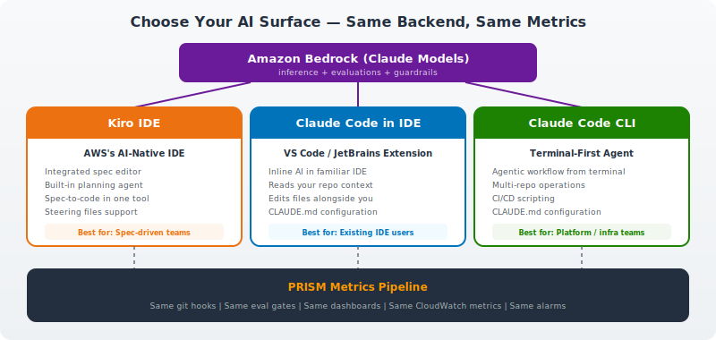
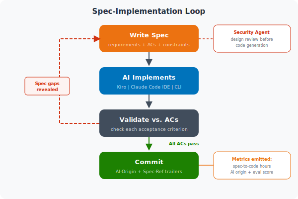

# Module 03: AI-Assisted Development

| | |
|---|---|
| **Duration** | 45 minutes (+10 min Security Agent extension) |
| **Prerequisites** | Module 01 complete (Claude Code configured), Module 02 complete (agent concepts) |
| **Learning Objective** | Write specs, implement with your preferred AI surface (Kiro, Claude Code in IDE, or Claude Code CLI), and understand how all surfaces feed the same PRISM metrics pipeline |

---

## Instructor Facilitation Guide

### [0-5 min] Why Specs Before Prompts

> **Instructor Note:** This is the conceptual anchor for the whole module. The temptation for engineers is to jump straight to "just tell the AI what to build." Make the case that 5 minutes writing a spec saves 30 minutes of prompt-iterate-revert cycles.

**Key talking points:**

1. **"Spec quality before spec automation"** — a core PRISM principle. If you can't write a clear spec that a human could implement, an LLM won't produce better results. The spec forces you to think before you prompt.

2. **The prompt-only failure mode:**
   - Developer tells the AI: "Add user auth"
   - AI produces JWT auth with bcrypt, 400 lines
   - Developer wanted OAuth with Cognito
   - Now they're debugging AI-generated code they don't understand
   - Net time: slower than writing it by hand

3. **The spec-first success mode:**
   - Developer writes a spec: OAuth via Cognito, these 3 endpoints, these error cases
   - AI implements exactly that
   - Developer reviews against acceptance criteria — pass/fail is clear
   - Iteration is targeted: "The token refresh doesn't match AC #3, fix it"

4. **Specs are reusable artifacts.** They live in your repo. New team members read them. Your PM can review them. Your eval gates (Module 05) test against them. A prompt in a chat window is throwaway; a spec is infrastructure.

---

### [5-10 min] Choose Your AI Surface

**All three surfaces use the same backend (Amazon Bedrock) and emit the same PRISM metrics.** The choice is about developer experience, not capability.



Present the three surfaces:

| Surface | What It Is | Best For | Spec Workflow |
|---|---|---|---|
| **Kiro** | AWS's AI-native IDE with built-in spec editor, planning, and agentic implementation | Teams wanting an integrated spec-to-code experience in one tool | Write spec in Kiro's spec editor → Kiro generates plan → Kiro implements → validate in IDE |
| **Claude Code in VS Code / JetBrains** | Claude Code extension embedded in the IDE participants already use | Teams on VS Code or JetBrains who want AI assistance inline without switching tools | Open spec in editor → Claude Code implements alongside → validate in editor |
| **Claude Code CLI** | Terminal-based agentic coding — reads your repo, edits files, runs commands | Platform engineers, infra teams, multi-repo work, CI/CD scripting | Feed spec from terminal → Claude Code implements → validate via tests or eval gate |

> **Instructor Note:** Ask the room: "Who uses VS Code? JetBrains? Terminal-first?" Split into tracks based on the majority. If mixed, default to Claude Code in VS Code (most common). The exercises work with any surface — the spec format is the same.

**Key message:** It doesn't matter which surface you choose. The spec is just markdown. The AI uses Bedrock. The git hooks capture the same `AI-Origin` trailer. The eval gates run the same rubrics. The dashboards show the same metrics. **PRISM is the unifying layer.**

---

### [10-15 min] The Spec Format

Walk through the spec structure on the projector:

```markdown
# Feature: [Name]

## Requirements
Numbered list of what the feature must do. Each requirement is
independently testable.

## Acceptance Criteria
Given/When/Then format. These become your test cases and your
eval rubric (Module 05).

## Design Constraints
Technical boundaries: which services to use, performance targets,
security requirements, compatibility constraints.

## API Contract (if applicable)
Method, path, request/response schemas. This becomes your OpenAPI
fragment and your contract test.
```

**Why this format works across all surfaces:**
- **Requirements** give the AI the scope boundary (Kiro uses these for planning, Claude Code uses them for implementation)
- **Acceptance criteria** give the AI testable success conditions (and feed the `spec-compliance` eval rubric)
- **Design constraints** prevent the AI from making architectural decisions you didn't authorize
- **API contracts** give the AI the exact interface to implement

> **Instructor Note:** In Kiro, open the spec editor and show the integrated experience — syntax highlighting, validation, autocomplete. Then show the same spec file opened in VS Code with Claude Code — same markdown, different editing experience. The spec is portable.

---

### [15-30 min] Hands-On: Write and Implement a Spec

#### Exercise 1: Write a Spec (10 min)

Direct participants to `exercises/01-write-auth-spec.md`.

They'll write a spec for a user authentication endpoint:
- The sample app needs a `POST /auth/login` endpoint
- It should validate credentials against a user store
- Return a JWT token on success
- Handle error cases explicitly

> **Instructor Note:** Resist the urge to give them the complete spec. The learning is in the writing. Let them struggle with what to include in acceptance criteria vs. design constraints. After 7 minutes, show the reference spec from solutions/ for comparison.

#### Exercise 2: Implement the Spec (10 min)

Direct participants to `exercises/02-implement-spec.md`.

**Each participant uses their preferred surface:**

| If Using | What They Do |
|---|---|
| **Kiro** | Open spec in Kiro → click "Plan" → review generated implementation plan → click "Implement" → Kiro writes the code |
| **Claude Code in VS Code** | Open spec file → open Claude Code panel → "Implement this spec" → Claude Code edits files inline |
| **Claude Code CLI** | `claude "Implement the spec at specs/user-auth.md"` → Claude Code reads spec, writes code, runs tests |

They'll:
1. Implement the spec using their chosen surface
2. Time how long implementation takes (this is the spec-to-code turnaround metric)
3. Validate implementation against acceptance criteria

> **Instructor Note:** Have participants call out their implementation times. Collect a range on the whiteboard. Typical: 2-5 minutes for a well-written spec, 10-15 minutes for a vague one. This makes the case for spec quality better than any slide. Also note: the surface doesn't significantly affect implementation time — spec quality does.

#### Exercise 3: Iterate When the Spec Has Gaps (5 min)

Direct participants to `exercises/03-spec-iteration.md`.

They'll:
1. Find a gap in their original spec (the AI's implementation reveals it)
2. Update the spec
3. Re-run the AI to implement the fix

> **Instructor Note:** This is where spec quality pays off. A good spec produces a good first pass. A vague spec produces multiple iterations. Ask: "How many of you had to iterate more than once?" That's a spec quality signal.

---

### [30-40 min] The Spec-Implementation Loop

Draw the loop on the whiteboard:



**Key metrics that emerge from this loop:**
- **Spec-to-Code Turnaround Time:** Time from spec completion to passing implementation
- **Spec Iteration Count:** How many loops before all ACs pass (lower = better spec)
- **AI First-Pass Acceptance Rate:** What % of acceptance criteria pass on the first AI run

These become dashboard metrics in Module 06.

**All surfaces emit the same commit trailers:**

```
feat: implement user auth endpoint

Spec-Ref: specs/user-auth.md
AI-Origin: claude-code    # or: kiro, q-developer
AI-Model: claude-sonnet-4
```

The git hooks detect the AI surface automatically via environment variables (`CLAUDE_CODE`, `KIRO_SESSION`, `Q_DEVELOPER_SESSION`) and tag accordingly.

---

### Spec-Driven Eval Gates

Specs don't just guide implementation — they power automated quality gates.

**Spec-Compliance Eval Rubric:**

When a commit includes a `Spec-Ref:` trailer, the PRISM eval gate runs an additional `spec-compliance` rubric:

| Criterion | Weight | What It Checks |
|---|---|---|
| Requirement coverage | 0.35 | All acceptance criteria from the spec are implemented |
| Interface adherence | 0.25 | Function signatures and API contracts match the spec |
| Edge case handling | 0.20 | Edge cases described in the spec are handled |
| Spec intent fidelity | 0.20 | Implementation captures the spirit, not just the letter |

Local testing with any surface:

```bash
./eval-harness/run-eval.sh rubrics/spec-compliance.json src/handler.ts --spec specs/user-auth.md
```

---

### AI-DLC Workflow Integration

The PRISM bootstrapper includes AI-DLC steering files (adapted from [awslabs/aidlc-workflows](https://github.com/awslabs/aidlc-workflows)) that guide any AI surface through a structured workflow:

1. **Inception** — workspace detection, requirements analysis, spec creation
2. **Construction** — design, code generation, build & test
3. **Security Review** — Security Agent design review + code review (when configured)
4. **Quality Gate** — eval gate runs automatically on PR

These steering files work with Claude Code (via CLAUDE.md), Kiro (via .kiro/steering/), and Q Developer (via .amazonq/rules/).

**Session Continuity:** The workflow tracks state in `.prism/session-state.json` so developers can resume across sessions regardless of which surface they use.

---

### [40-45 min] Extension: Security Agent Design Review (+10 min)

> **Instructor Note:** This exercise requires AWS Security Agent access. Skip if not available — demonstrate with screenshots instead. See the [Security Agent Setup Guide](../../bootstrapper/security-agent/SETUP-GUIDE.md) for console configuration steps.

**Context:** You've written a spec. Before writing code, Security Agent reviews it for architectural security risks.

**They will:**
1. Take the spec from Exercise 1 (e.g., `specs/user-auth.md`)
2. Submit it to Security Agent for design review
3. Review the findings — security risks identified before a single line of code
4. Revise the spec based on findings

| Finding | What It Means |
|---|---|
| "No rate limiting specified for auth endpoint" | Spec missing a non-functional requirement |
| "Token storage mechanism not defined" | Spec needs a design constraint about secure storage |
| "No session expiry policy" | Spec needs an acceptance criterion for session management |

**The metric:** `FindingSurvivalRate` — percentage of design review findings surviving to code review or pen testing. Lower = catching issues earlier. Visible in the CISO Compliance dashboard.

> **Instructor Note:** "The spec is your first line of defense. Security Agent proves it."

---

### [40-45 min] Wrap-Up

**Check for understanding:**
- "What goes wrong when you skip the spec and go straight to prompting?"
- "Does it matter which AI surface you use?" (Answer: No — same Bedrock backend, same metrics, same eval gates)
- "How does spec iteration count tell you about spec quality?"
- "Why run a security design review before writing code?" (Answer: Cheaper to fix a spec than to fix deployed code)

**Bridge to Module 04:** You've now written specs and implemented them with your preferred AI surface. Every commit has AI origin metadata. But that metadata is sitting in git doing nothing. Next module, we wire it into a real metrics pipeline.

---

## Common Questions

**Q: Do I need Kiro to use specs?**
A: No. Specs are just markdown files. You can write them in any text editor, VS Code, or Kiro. Kiro provides a richer spec authoring experience (syntax highlighting, validation, integrated planning), but the format is identical. Claude Code in any surface can implement against the same spec file.

**Q: Is Claude Code only a CLI tool?**
A: No. Claude Code is available as a CLI, a VS Code extension, a JetBrains extension, and a web app. The CLI is one surface. Most developers use the IDE extension for daily coding and the CLI for automation, scripting, or multi-repo work.

**Q: How does Kiro relate to Claude Code?**
A: Kiro is AWS's AI-native IDE that uses Claude (via Bedrock) as its underlying agent. Claude Code is Anthropic's agentic coding tool available across CLI and IDE extensions. Both use the same Bedrock models. Both emit the same PRISM metrics. Kiro emphasizes spec-driven planning; Claude Code emphasizes flexible agentic implementation. Teams often use both — Kiro for spec authoring, Claude Code for implementation.

**Q: Is this overkill for a simple bug fix?**
A: For a one-line typo fix, yes. The general rule: if you can describe the change in one sentence AND verify it with one test, skip the spec. If either condition fails, write one. Over time, teams calibrate their own threshold.

**Q: Can the AI write the spec for me?**
A: It can draft one, and that's a valid workflow — especially for well-understood patterns. But someone with domain knowledge must review and approve the spec before implementation. AI-generated specs that go straight to AI implementation is a garbage-in-garbage-out loop.

**Q: How do specs differ from Jira tickets?**
A: Jira tickets describe what the business wants. Specs describe what the code must do, in enough detail that an LLM (or a new engineer) can implement it without asking questions. A Jira ticket says "Users need to log in." A spec says "POST /auth/login accepts {email, password}, validates against Cognito user pool X, returns {token, expiresIn} with 200, returns 401 with Problem Details on bad credentials."

**Q: Which surface should my team use?**
A: Start with what they already know. VS Code teams → Claude Code extension. Terminal-first teams → Claude Code CLI. Teams wanting integrated spec-driven workflow → Kiro. They can switch later — the specs, metrics, and eval gates are surface-agnostic.
